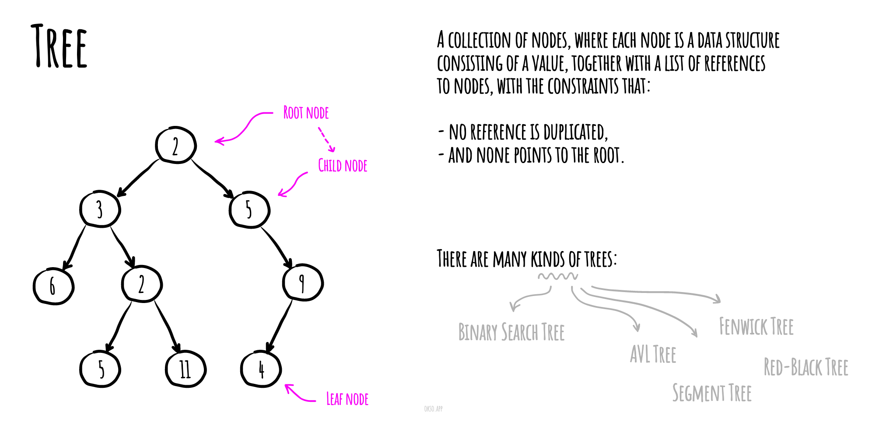

# 树

- [二叉搜索树](binary-search-tree)
- [AVL 树](avl-tree)
- [红黑树](red-black-tree)
- [线段树](segment-tree) - with min/max/sum range queries examples
- [芬威克树/Fenwick Tree](fenwick-tree) (Binary Indexed Tree)

在计算机科学中, **树(tree)** 是一种广泛使用的抽象数据类型(ADT)— 或实现此 ADT 的数据结构 — 模拟分层树结构, 具有根节点和有父节点的子树,表示为一组链接节点。

树可以被(本地地)递归定义为一个(始于一个根节点的)节点集, 每个节点都是一个包含了值的数据结构, 除了值,还有该节点的节点引用列表(子节点)一起。
树的节点之间没有引用重复的约束。

一棵简单的无序树; 在下图中:

标记为 7 的节点具有两个子节点, 标记为 2 和 6;
一个父节点,标记为 2,作为根节点, 在顶部,没有父节点。

_Made with [okso.app](https://okso.app)_

## 参考

- [Wikipedia](<https://en.wikipedia.org/wiki/Tree_(data_structure)>)
- [YouTube](https://www.youtube.com/watch?v=oSWTXtMglKE&list=PLLXdhg_r2hKA7DPDsunoDZ-Z769jWn4R8&index=8)
