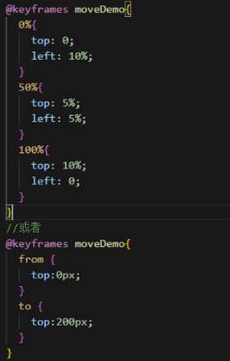

## CSS

### 布局

> calc()：定义高度宽度等值时进行加减乘除操作，实现更灵活和动态的布局。

比如：

```css
div {
  width: calc(100% - 20px);
}
```

#### flex-grow 属性

它定义了项目的放大比例，默认为 0，即如果存在剩余空间，也不放大。如果希望某个元素占满剩余的空间，可以将其 flex-grow 属性设置为 1 或者其他大于 0 的数值，表示它会占据剩余空间的全部或对应的比例。
而且要先把整个页面的高度定义死，比如让#app 高度为 100%

eg.

```css
body,
html {
  height: 100%; /* 确保 body 和 html 高度为100% */
  margin: 0;
  padding: 0;
}

.container {
  display: flex; /* 设置为 Flex 布局 */
  flex-direction: column; /* 子元素垂直排列 */
  height: 100%; /* 确保.container占满整个屏幕的高度 */
}

.header {
  height: 100px;
}

.main {
  flex-grow: 1; /* header 固定后，main 占据剩余的空间 */
}
.aside {
  width: 200px;
  margin-right: 10px;
}
.content {
  flex-grow: 1;
}
```

#### 定位

> 在 CSS 中，`position: absolute;` 属性会使一个元素脱离正常的文档流，并相对于最近的非 `static` 定位祖先元素进行定位。如果这个祖先元素没有设置定位（默认是 `static`），那么 `absolute`元素会相对于浏览器窗口进行定位。

eg.

当有一个大的父级 div 里面包裹的子级 div 需要用到`position: absolute;`时，要先在这个大容器上使用 `position: relative;`，因为它可以为内部子元素提供一个相对定位上下文，同时自身又能保持在正常文档流中。

### 过渡与动画

#### transform

> 此属性允许旋转、缩放、倾斜或平移给定元素。这是通过修改 CSS 视觉格式化模型的坐标空间来实现的。

eg. 我们可以使用  `transform: scale(2);`  来将元素的大小放大两倍，或使用  `transform: rotate(45deg);`  来旋转元素 45 度。

#### transition

> 此属性是 CSS3 的一个新特性，它可以在一定的时间内平滑地改变 CSS 属性的值。

> 主要应用：使浏览器在一个属性值逐渐改变成另一个属性值时，可以创建出过渡的动画效果。

eg. 我们可以使用  `transition: all 2s;`  来设置一个元素的所有属性在两秒内从当前值过渡到新值。

Transition-group  是 Vue 提供的一个特殊组件，用于管理 **多个元素或组件** 的过渡效果。

这个组件用来对列表中元素的添加（进入）和删除（离开）进行动画的封装。

主要属性和功能：

- `name`：用作过渡类名的前缀。也就是说，实际上你在这个元素上会看到诸如  `.xxx-enter` , `.xxx-enter-active`, `.xxx-leave-active`  这样的类名，其中的  `xxx`  就是  `name`  属性的值。
- `tag`：当你希望 `<transition-group>` 渲染为特定类型的 HTML 标签时，可以使用 tag 属性来指定。如果不指定，则默认渲染为 `<span>` 标签。
- `move-class`：在 `<transition-group>` 中，当列表项改变其位置时，会应用一个特殊的过渡类名，默认是 .v-move。如果需要自定义这个移动过渡效果，可以通过 move-class 属性来设置自定义的类名。

<font color=Red>注：</font> 
transition-group  的用法和 Vue 其他组件略有不同，它会渲染一个真实的 DOM 元素：默认为一个  `<span>`  元素，这个元素可以通过  tag  属性进行修改。

eg.

```html
<transition-group name="list" tag="ul">
  <li v-for="item in items" :key="item">{{ item }}</li>
</transition-group>
```

上述代码中，我们定义了一个列表的过渡动画，每次列表项的增加或删除，都会有相应的动画效果。

#### @keyframes

> 这个 CSS 关键帧规则，它能够创建复杂的、多阶段的动画。

在  `@keyframes`  中，可以定义一个动画的各个阶段，以及每个阶段的样式。然后可以使用  `animation`  属性来调用定义好的  `@keyframes`  动画。

eg. 可以使用  `@keyframes move { 0% { top: 0;} 100% { top: 200px; } }`  来创建一个元素从 top 0px 移动到 200px 的动画。

它还使用了关键字`@keyframes`来定义动画。这里可以用`from{}to{}`或者用百分比充当时间点。具体格式为：

```css
/* slidein为动画名称 */
@keyframes slidein {
  from {
    transform: translateX(0%);
  }

  to {
    transform: translateX(100%);
  }
}
```



比如需要给 div 添加动画效果：

```css
/*动画速度曲线*/
 /*animation-timing-function: linear;
   linear 匀速
   ease 先慢后快，默认
   ease-in 慢速开始
   ease-out 慢速结束
   ease-in-out 开始和结束都慢*/

/* 前两个数据含义：运动总时间 延迟的动画时间（单位是秒或者毫秒） */
/* animation是所有动画属性的简写，除了animation-play-state属性 */
div{
	animation：1s 2s 动画名称 运动方式 动画执行的次数
}
```

#### 区别

- `transform`  是用于改变元素的形状和位置，例如旋转和缩放等。
- `transition`  是用于控制属性值的变化速度，以创建平滑的动画效果。
- `@keyframes`  则是用于定义复杂的、可以有多个阶段的动画。

它们常常被组合使用来创建复杂的动画效果。例如我们可以使用  `transform`  来定义动画的每个阶段，使用  `transition`  来控制动画的速度，最后通过  `@keyframes`  来集合这些阶段，创建出一整个完整的动画。

### Vue 封装的过渡与动画

#### 作用

在插入、更新或移除 DOM 元素时，在合适的时候给元素添加样式类名。

#### 写法:

##### ① 准备好样式 :

```
-元素进入的样式:
v-enter:进入的起点
v-enter-active:进入过程中
v-enter-to:进入的终点
-元素离开的样式:
v-leave:离开的起点
v-leave-active:离开过程中
v-leave-to:离开的终点
```

##### ② 使用`<transition>`包裹要过渡的元素，并配置 name 属性:

```html
<transition name="hello">
  <h1 v-show="isShow">你好啊!</h1>
</transition>
```

若有多个元素需要过度，则需要使用: `<transition-group>`，且每个元素都要指定 key 值

### 设置滚动条样式

示例：

```css
/* 滚动条整体 */
::-webkit-scrollbar {
  width: 8px;
}

/* 滚动条滑块 */
::-webkit-scrollbar-thumb {
  background-color: #888;
  border-radius: 4px;
}

/* 滚动条外层轨道 */
::-webkit-scrollbar-track {
  border-radius: 8px;
  background: #eeeeee;
}

::-webkit-scrollbar-track:hover {
  background-color: #f1f1f1;
}

::-webkit-scrollbar-thumb:hover {
  background-color: #555;
}
```

## TS

### 类型别名

type 关键字（可以给一个类型定义一个名字）多用于符合类型

#### 定义类型别名

```ts
type str = string;
let s: str = "123";
```

#### 定义函数别名

```ts
type str = () => string;
let s: str = () => "123";
```

#### 定义联合类型别名

```ts
type str = string | number;
let s: str = 123;
let s2: str = "123";
```

#### 定义值的别名

```ts
type value = boolean | 0 | "213";
let s: value = true; //变量s的值  只能是上面value定义的值
```

#### Omit

> 在 TypeScript 中，Omit<T, K> 是一个内置的工具类型，它用于从给定的类型 T 中排除指定的一组属性 K，从而创建一个新的类型。这个新类型会包含 T 类型中除 K 列出的属性之外的所有其他属性。

> 使用场景：当你想基于现有类型定义一个新的类型，并且不希望新类型包含某些特定属性时。

eg.定义一个只有 arrItem 的 address 属性的类型

```ts
// 当arrItem是一个数组时
interface detailItem {
  name: string;
  age: string;
  address: string;
}

// 定义一个新的元素类型，排除 'name' 和 'age'
type NewDetailItemType = Omit<detailItem, "name" | "age">;

// 然后可以定义一个基于新元素类型的数组
type detailList = NewDetailItemType[];
```

​ 如果不需要排除就可以直接定义它是数组`type detailList = detailItem[];`

> 当我如果需要使用时

```js
const dataList = ref < detailList > [];
//默认选中数组第一条数据
const selectedItem = ref(dataList.value[0]);
```

## Vue

### ref 与 reactive

- ref 用于创建单个响应式数据，需要通过.value 来访问和修改值。
- reactive 用于创建包含多个属性的响应式对象，无需特殊的访问方式，直接访问和修改属性即可。

### 插槽

> 插槽就是把常见的组件组合方式抽象成模版，组件可以按插槽名插到模版指定位置

> `<slot>` 元素用于定义组件的内容分发点。当父组件使用子组件时，可以在子组件标签内使用 template 标签配合 #slotName 的语法来定义插槽内容，这些内容将会被插入到子组件中对应名称的 `<slot name="slotName">` 位置。

比如在 father.vue 里面

```vue
<ListContainerVue>
  <template #content>
    <!-- 这里是将要插入到 ListContainerVue 组件“content”插槽中的内容 -->
  </template>
</ListContainerVue>

<script lang="ts" setup>
import ListContainerVue from "@/components/ListContainer.vue";
</script>
```

然后就在 子组件 ListContainer.vue 里面写

```vue
<!-- 子组件 (ListContainerVue) 定义 -->
<template>
  <!-- ...其它HTML结构... -->
  <div>
    <!-- 插槽位置，任何传递给 "content" 名称的插槽内容将显示在这里 -->
    <slot name="content"></slot>
  </div>
  <!-- ...其它HTML结构... -->
</template>
```

这样，父组件就可以自定义子组件的特定部分内容了。
